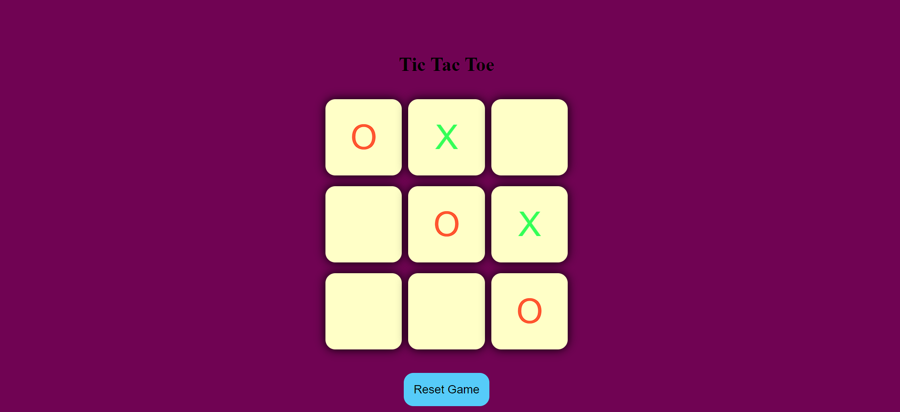

### Tic Tac Toe Game

This project is a simple implementation of the classic Tic Tac Toe game using HTML, CSS, and JavaScript.

## Preview

## Features

- **Player Turns:** Players alternate turns between X and O.
- **Win Detection:** The game detects and announces the winner when a player gets three in a row.
- **Reset and New Game:** Options to reset the current game or start a new one.
- **Responsive Design:** Designed to work well on various screen sizes.

## How to Play

1. **Clone the Repository:** Clone this repository to your local machine using `git clone`.
   
2. **Open the Game:** Open the `index.html` file in your preferred web browser.

3. **Game Rules:**
   - Click on any box to place your mark (X or O).
   - Players take turns to play until there is a winner or a draw.
   - The game announces the winner or declares a draw.
   - Use the "New Game" button to start a new game without refreshing the page.
   - Use the "Reset Game" button to restart the current game.

## Files Included

- **index.html:** Main HTML file that sets up the game board and controls.
- **style.css:** CSS file for styling the game interface.
- **app.js:** JavaScript file containing the game logic, including turn management and win detection.

## Technologies Used

- **HTML:** For creating the structure of the game.
- **CSS:** For styling the game board and controls.
- **JavaScript:** For implementing the game's functionality, including player turns and win detection.

## Video link

Watch a demo of this Tic Tac Toe game in action: [Tic Tac Toe Demo Video](https://youtu.be/SqrppLEljkY?si=k57-uiBtfbpGjQcr)
