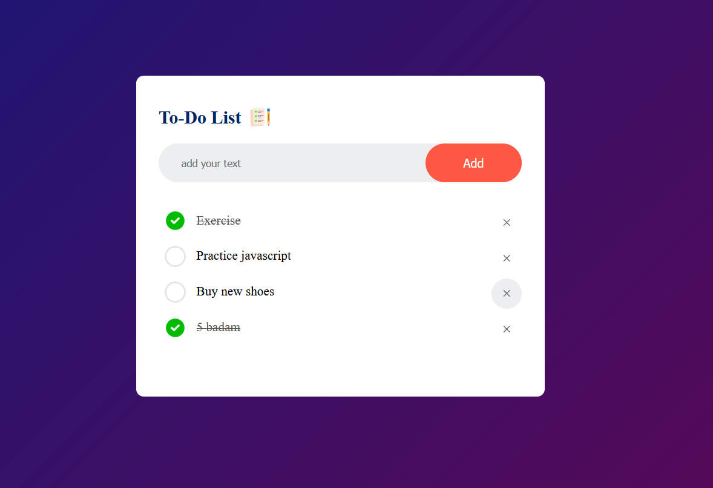

# To-Do List Application

This project is a simple implementation of a To-Do List app using HTML, CSS, and JavaScript, designed to help users organize and track their daily tasks.

## Preview

## Features
- **Add Task:** Users can add tasks to the list by typing in the input field and clicking the "Add" button.
- **Mark as Completed:** Users can mark tasks as completed by clicking on the task, which adds a strikethrough effect.
- **Delete Task:** Users can remove tasks from the list by clicking the "×" button next to each task.
- **Persistent Data:** The app stores the task list in the browser's local storage, allowing the tasks to remain available even after refreshing the page.
- **Responsive Design:** The app is designed to work well on various screen sizes.

## How to Use
1. **Clone the Repository:** Clone this repository to your local machine using `git clone`.
2. **Open the App:** Open the `index.html` file in your preferred web browser.
3. **Add a Task:** Type in the input field and click the "Add" button to add a new task.
4. **Mark as Completed:** Click on any task to mark it as completed. Completed tasks will be crossed out.
5. **Delete a Task:** Click the "×" button next to any task to remove it from the list.
6. **Data Persistence:** Your tasks will be saved automatically in your browser's local storage and will reappear the next time you open the app.

## Files Included
- **index.html:** The main HTML file that sets up the structure of the to-do list app.
- **style.css:** The CSS file that styles the interface of the to-do list.
- **app.js:** The JavaScript file that implements the app's functionality, including adding, marking, and deleting tasks, as well as storing data in local storage.

## Technologies Used
- **HTML:** Used to create the structure of the application.
- **CSS:** Used to style the user interface, including the task list, input box, and buttons.
- **JavaScript:** Used to add dynamic functionality, such as adding tasks, marking them as completed, and saving the task list to local storage.

## Video Demo
Watch a demo of this To-Do List app in action: [To-Do List Demo Video](https://www.youtube.com/watch?v=G0jO8kUrg-I)

## Conclusion
This To-Do List application is a simple yet effective tool to manage your daily tasks. Its clean design and intuitive functionality make it easy to use for anyone.