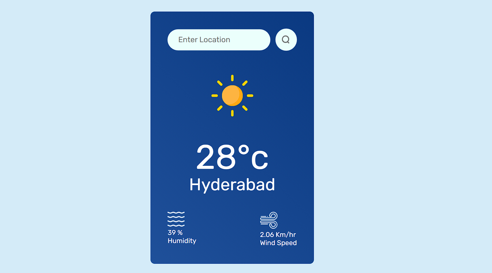
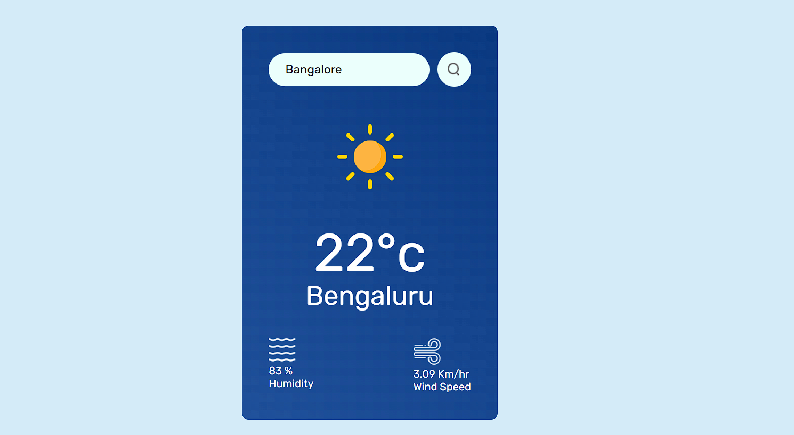

# Weather App 🌦️  

A **React.js Weather Application** that provides real-time weather updates for any city around the globe. It displays temperature, humidity, wind speed, and weather conditions, along with a visually appealing interface.

---

## 📸 Screenshots  

  
  


---

## ✨ Features  

- **Real-Time Weather Data**: Fetches data from the OpenWeatherMap API.  
- **Search Functionality**: Search for weather in any city by entering its name.  
- **Default City**: Automatically displays weather for Hyderabad on the first load.  
- **Detailed Weather Data**: Displays temperature, humidity, wind speed, and current weather icon.  
- **Responsive Design**: Optimized for desktops, tablets, and mobile devices.  

---

## 🚀 Technologies Used  

- **React.js**: Frontend framework for building the application.  
- **CSS**: Styling the application with custom CSS.  
- **OpenWeatherMap API**: To fetch real-time weather data.  

---

## 🛠️ Getting Started  

### Prerequisites  
- Node.js and npm installed on your system.  
- An API key from [OpenWeatherMap](https://openweathermap.org/).  

### Installation  

1. Clone the repository:  
   ```bash  
   git clone https://github.com/your-username/weather-app.git  
   cd weather-app  
   ```  

2. Install dependencies:  
   ```bash  
   npm install  
   ```  

3. Create a `.env` file in the root directory and add your API key:  
   ```env  
   VITE_APP_ID=your_openweathermap_api_key  
   ```  

4. Start the application:  
   ```bash  
   npm run dev  
   ```  

5. Open your browser and visit:  
   ```
   http://localhost:5173  
   ```  

---

## 🌐 API Integration  

- The app uses the OpenWeatherMap API endpoint:  
  ```
  https://api.openweathermap.org/data/2.5/weather?q={city}&units=metric&appid={API_KEY}  
  ```  

---

## 📚 Future Improvements  

- Add a feature to display a 7-day weather forecast.  
- Allow users to toggle between Celsius and Fahrenheit.  
- Improve error handling for network failures.  

---

## 🤝 Contributing  

Contributions, issues, and feature requests are welcome!  
Feel free to check the [issues page](https://github.com/your-username/weather-app/issues).  

---

## 🎥 Tutorial  

Watch the full tutorial for building this Weather App on [YouTube](https://youtu.be/zs1Nq2s_uy4?si=wB7p0P7sq9_BuzCB).  
