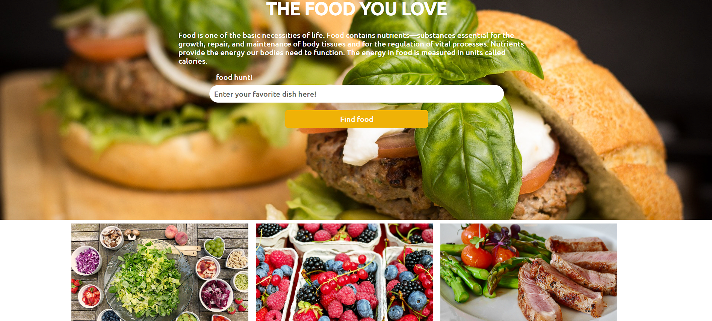

# FOOD HUNT! 🍔🥗🍓 

A visually appealing website for exploring food categories and their nutritional information. Discover your favorite dishes or learn more about the food you love!  

---

## 📸 Screenshots  

- **Hero Section**  
    

---

## ✨ Features  

- **Hero Section with Search Functionality**:  
  A visually captivating hero section with a search form to enter your favorite dish.  

- **Informative Product Section**:  
  Features categories like Vegetables, Fruits, and Non-Vegetarian foods, each with images and descriptions.  

- **Responsive Design**:  
  The website is fully responsive, ensuring a seamless experience across devices.  

---

## 🚀 Technologies Used  

- **HTML5**: Structuring the content.  
- **CSS3**: Styling the website with custom CSS.  
- **Normalize.css**: Ensures consistency across different browsers.  
- **Google Fonts**: Used for elegant typography.  

---

## 🛠️ Getting Started  

### Prerequisites  
- A modern browser to view the website.  

### Installation  

1. Clone the repository:  
   ```bash  
   git clone https://github.com/your-username/food-hunt.git  
   cd food-hunt  
   ```  

2. Open the project directory and serve the files:  
   - Use [Live Server](https://marketplace.visualstudio.com/items?itemName=ritwickdey.LiveServer) for real-time previews.  
   - Or open the `index.html` file directly in a browser.  

---

## 🌐 Project Structure  

- `index.html`: Main HTML file.  
- `styles.css`: Custom styles for the project.  
- `normalize.css`: For consistent cross-browser rendering.  
- `images/`: Directory containing the images used in the project.  

---


